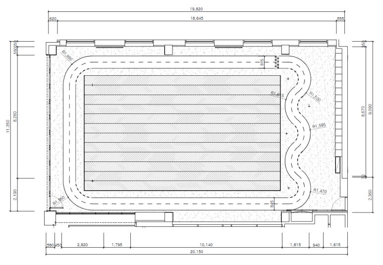
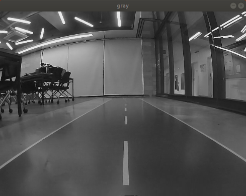
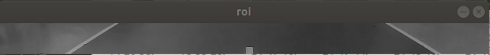
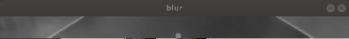
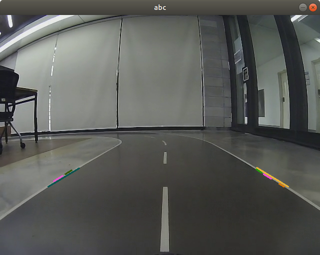
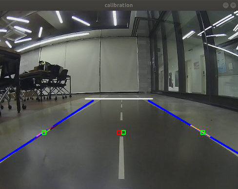

# Programmers Autonomous-Driving Dev course. Lane-following Competition

## Video
---

 

## Goal
---

- 차선을 벗어나지 않고 3바퀴 연속 주행

## Environment
---
- Ubuntu 18.04
- ROS Melodic
- Xycar 무슨 모델인지 까먹음 ㅎㅎ
- Nvidia TX 2

## Structure
---
~~~
Project2
  └─ src
  │    └─ main.py               # xycar drive main code
  │    └─ main_video.py         # video drive main code
  │    └─ imageProcessing.py    # imageProcessing Module
  │    └─ pid.py                # PID Module
  │    └─ movingAverage.py      # movingAverage Filter Module
  └─ launch
        └─ main.launch           # xycar drive main launch
        └─ src
~~~

## Usage
---
~~~bash
$ roslaunch Project2 main.launch
~~~

## Procedure
---
### lane detection
1. gray scale  
  
2. roi  
  
3. Gaussian blur  
  
4. Canny edge  

5. HoughLinesP로 차선 후보 검출  
  
6. 차선 후보 중 offset(특정 y값)의 x 좌표를 왼쪽 차선과 오른쪽 차선으로 선정  
  

### steering control
1. 화면의 중심을 기준으로 왼쪽 좌표와 오른쪽 좌표의 중심과의 차이를 구해서 error 도출
2. 한쪽 좌표가 없어졌을 때를 코너로 인식
3. 직선과 코너에 다르게 PID 제어

## Try
---
1. PID Control
2. Moving Average Filter
3. 2-way Lane Detection

## Limitations
---
- 바닥에 비친 형광등, 기둥을 차선으로 인식하여 차선을 벗어나는 경우가 있었다. 
  - 카메라 노출도 조정과 한쪽 차선만 검출하여 해결
- PID 제어를 사용할 때 직선 구간에서 똑바로 가지 못함 
  - PID값을 조절하여 P = 0.25, I = 0.0005, D = 0.25 으로 설정했을 때 가장 안정적이었음.
- 하지만 위 PID 값을 적용했을 때, 곡선에서 차선 이탈을 하는 문제가 있었음 
  - 곡선과 직선에서의 PID값을 따로 주어 해결 -> 곡선 P = 0.5, I = 0.0, D = 0.25 로 설정. 
## What I've learned
---
- hough
- PID
- MovingAverageFilter
